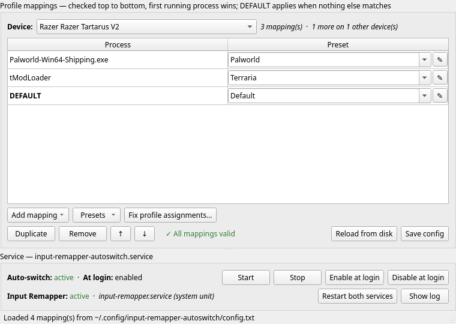

# Saito's AutoSwitcher/Recorder for Input Remapper

Two things [Input Remapper](https://github.com/sezanzeb/input-remapper) doesn't
do on its own:

**Auto-switching.** Presets change automatically based on which program is
running, so your keypad, mouse or keyboard gets the right layout the moment a
game starts and goes back to your default when it exits — per device, and
independently for each.

**Macro recording.** A preset editor that records both halves of a mapping from
real hardware: press the key to bind, then press the sequence it should produce.
Keys, chords, mouse clicks and the pauses between them become an Input Remapper
macro, instead of typing symbol names by hand.

Plus a GUI for the switching rules, importing games straight from your Steam
libraries, and repairing presets broken by a stale device ID.



## Why this exists

This was one of my frustrations when I switched to Linux: there was no software
that covered everything Razer Synapse did. Input Remapper came close, but it was
missing automatic switching and macro recording for ease of use.

I gradually started tinkering to bridge that gap for myself. After a lot of
testing it is in a decent enough state that others might find it useful, so I
decided to make it available. It began as just my own switching script — it
worked, but it was not in a good state for anyone else to use — and Claude Code
was used as a helper to fix a lot of things and get it to where it is now.

This is in no way affiliated with Input Remapper; it is just something I started
to fit my own needs. But if it stops someone having to switch back to Windows
over gaps like this, then great.

## What it does

A small shell loop checks the process list every few seconds. For **each device
independently**, the first rule whose process is running wins and its preset is
applied; when nothing matches, that device's optional `DEFAULT` rule is used. A
preset is only re-applied when the target actually changes, so it stays quiet and
cheap.

## Requirements

- Linux with [Input Remapper](https://github.com/sezanzeb/input-remapper) **2.x**
  (developed against 2.2.1), and at least one device with presets. The switcher
  itself is version-agnostic, but the preset editor, macro recorder and profile
  repair all read the 2.x preset format — see the version note below.
- `bash`, `pgrep` (procps), `flock` (util-linux, optional)
- `python3` + `PyQt6` + `python-evdev` — for the GUI only; the switcher runs
  without them
- systemd user session for autostart — an XDG autostart entry is used otherwise
- `notify-send` (libnotify) for desktop notifications, optional

`./install.sh --check` reports exactly what's missing and the install command for
your distro.

## Install

```sh
git clone https://github.com/TakeyaSaito/saitos-autoswitcher-recorder-for-inputremapper.git
cd saitos-autoswitcher-recorder-for-inputremapper
./install.sh
```

**Everything lives in one folder.** The scripts and `config.txt` sit together,
because each half looks for its config beside itself and nowhere else — so the
whole thing can be moved, kept on another drive, or tracked as a git checkout
and updated with `git pull`. By default that folder is the one you ran
`install.sh` from, and nothing is copied.

`./install.sh --prefix ~/Apps/autoswitch` copies the program *and* its config
there and runs it from there instead. Either way the rule is the same: one
folder, program and config together.

Only these small integration points go elsewhere in `$HOME`, all pointing back
at that folder:

| What | Where |
|------|-------|
| Program + config | *one folder — where you installed it* |
| Commands | `~/.local/bin/input-remapper-autoswitch{,-gui}` |
| Service | `$XDG_CONFIG_HOME/systemd/user/input-remapper-autoswitch.service` |
| Menu entry + icon | `$XDG_DATA_HOME/applications/`, `.../icons/hicolor/` |
| Preset backups | `$XDG_DATA_HOME/input-remapper-autoswitch/preset-backups/` |

Per-user, no root, nothing written outside `$HOME`. Re-running `install.sh`
follows the install you already have rather than relocating it; pass `--here` or
`--prefix` to move it deliberately. If you move the folder yourself, re-run
`./install.sh` from its new home so the launchers follow.

It shows exactly what it will do and where, then asks before touching anything.
Double-clicking `install.sh` in a file manager works too — it reopens itself in a
terminal so you can read the report and answer the prompt.

Options: `--prefix DIR`, `--here`, `--yes`, `--no-service`, `--no-desktop`,
`--no-start`, `--no-install-deps`, `--check`.

Missing dependencies are detected and, with your confirmation, installed for you
— it maps package names across pacman, apt, dnf, zypper, apk, xbps, emerge and
eopkg, and escalates with sudo, doas, run0 or pkexec.

Uninstall with `./uninstall.sh` (add `--purge` to drop the config too). It reads
the installed launcher to find where everything went, so it works whichever
layout you chose — and it never deletes the folder it is running from. Your Input
Remapper presets are never touched.

### Running from a checkout, or anywhere

You don't have to install it. Put the folder wherever you like and run it in
place — both halves use the `config.txt` beside them, so the folder stays
self-contained and can be moved without breaking:

```sh
cp config.example.txt config.txt     # optional; the GUI creates it on save
./auto-switch.sh start
python3 autoswitch-gui.py
```

## Usage

```sh
input-remapper-autoswitch-gui                      # configure
input-remapper-autoswitch {start|stop|status|restart|paths}
journalctl --user -u input-remapper-autoswitch -f  # watch it switch
```

`paths` prints every path and setting in effect — the first thing to check when
something isn't being picked up.

## The GUI

**Device selector** at the top scopes everything below it. Mappings for other
devices are kept, just hidden; the counter beside it says how many. The window
reopens on whichever device you used last.

**Mappings** are `process → preset` rows. The process fragment is matched against
the full command line, and the preset dropdown lists that device's presets. Rules
are checked top to bottom, so order matters; `DEFAULT` is the fallback.

**Add mapping ▾**

- *From Steam library* — scans every Steam library and works out each game's real
  executable. Unreal Engine games are matched on the actual
  `…/Binaries/Win64/<Game>-Win64-Shipping.exe` rather than the stub launcher in
  the install root, which is what the process list actually shows. Every
  candidate binary it found stays available in a dropdown, and the field is
  editable when a game does something unusual.
- *From running process* — pick from the live process list.
- *Manual* — type it yourself.

**Presets ▾** creates a preset from `Default`, creates an empty `Default` for a
new device, and opens any preset of any device in the editor. The ✎ button on a
row opens that row's preset directly.

**Fix profile assignments** repairs presets broken by a stale device ID — see
below. It turns red on startup when it finds any.

## Editing presets

The editor shows a preset's mappings and, for the selected one, its input,
output, target device and type. **Remapping is paused for as long as the editor
is open**, so nothing is remapping your hardware while you map it, and every
device reports its raw keys.

- **Record** (input) captures the key you press on this device — hold several at
  once for a combination. The device is grabbed exclusively so the key doesn't
  fire while you bind it; Esc cancels.
- **Edit** (output) opens the macro editor.
- **Loop if held** wraps the output in `hold(…)` so it repeats while the input is
  held, with a **loop delay** field that paces each pass.
- **Sends to** is detected from the output — keyboard keys to the keyboard, mouse
  buttons to the mouse, a mix to both — using Input Remapper's own capability
  tables. Choosing one yourself stops it being adjusted.
- **Analog output** appears only for axis mappings, with the deadzone/gain/expo
  knobs that go with it.
- Anything else already on a mapping (`release_timeout`, `macro_key_sleep_ms`, …)
  is carried through untouched on save.

### The macro editor

Records a whole sequence — keys, chords and the pauses between them — and turns
it into Input Remapper macro text:

```
key(KEY_1).wait(600).hold_keys(KEY_2, KEY_3)
```

- It opens **idle**; press **Start recording** when you're ready. Stop, edit, and
  press it again to append more.
- An existing macro is loaded as editable steps, so you continue where you left
  off. Anything it can't represent is left alone rather than mangled.
- Steps can be removed (select and press Delete) and waits retimed.
- **Fixed delay** inserts the same pause between every step instead of recording
  how long you actually took.
- Mouse clicks are recorded too. Clicks keep working normally, and the click that
  presses **Stop** is removed from the macro along with the pause before it.

> **Version note.** The recorder writes Input Remapper's 2.x macro syntax —
> `key()`, `wait()`, `hold_keys()`, `hold()` — and reads presets in the 2.x
> format, where each mapping carries an `input_combination` with an
> `origin_hash`. Input Remapper 1.x used a different preset format and a
> different macro language, so the preset editor, the macro recorder and **Fix
> profile assignments** will not work against it. Developed and tested against
> **2.2.1**. If a future release changes the macro language again, the recorder
> will need updating to match — it validates everything it produces through
> Input Remapper's own `UIMapping`, so a mismatch shows up as a refused mapping
> rather than a silently broken preset.

### Safeguard: left click

A preset that consumes `BTN_LEFT` without producing one anywhere would leave you
unable to click — including on the window you'd need to undo it. That's warned
about when recorded, flagged while editing, and confirmed before saving (default
Cancel). An auto-fire like `BTN_LEFT → hold(key(BTN_LEFT).wait(50))` is fine,
because the click still comes out.

## Config format

`config.txt`, one rule per line, `|`-separated. See
[`config.example.txt`](config.example.txt).

```
process_fragment | device name | preset name (without .json)
```

```
Palworld-Win64-Shipping.exe|Razer Razer Tartarus V2|Palworld
tModLoader|Razer Razer Tartarus V2|Terraria
DEFAULT|Razer Razer Tartarus V2|Default
```

- **process fragment** — matched against the full command line with `pgrep -fi`,
  so a distinctive substring is enough. Case-insensitive.
- **device name** — exactly as Input Remapper names it
  (`input-remapper-control --list-devices`, or pick it from the GUI).
- **preset name** — the preset file without `.json`.
- Order matters within a device: first match wins. `#` starts a comment.
- `DEFAULT` is that device's fallback. Optional, and each device has its own.

### Settings

`settings.conf`, next to `config.txt`. It is parsed, never executed.

```ini
check_interval=5        # seconds between process checks
reload_interval=60      # seconds between config reloads
notifications=1         # 0 to silence desktop notifications
input_remapper_config_dir=   # empty = auto-detect
```

### Where the config is looked up

Both the switcher and the GUI resolve it identically, first hit wins:

1. `--config FILE`
2. `$AUTOSWITCH_CONFIG`
3. `$AUTOSWITCH_CONFIG_DIR/config.txt`
4. **`config.txt` next to the script** — the default

That last rule is what makes the folder self-contained: drop it on a USB stick or
anywhere in `$HOME`, and both halves read the `config.txt` sitting beside them.
Nothing is searched for elsewhere, so there is no way to end up with the GUI and
the switcher quietly editing different files.

`$INPUT_REMAPPER_CONFIG_DIR` overrides where Input Remapper presets are read
from.

## Keys that are mapped but do nothing

Input Remapper stamps every mapping with an `origin_hash` identifying the exact
`/dev/input/eventXX` it was recorded from:

```python
md5(str(device.capabilities(absinfo=False)) + device.name)
```

It's meant to be stable across reboots and machines — but it's derived from the
device's *reported capabilities*, so a kernel, driver or firmware update that
changes them changes the hash. Every mapping recorded before that keeps pointing
at a device node that no longer exists. Input Remapper still shows the key as
assigned; it simply never fires. Re-recording the key by hand fixes that one
mapping, which is the usual workaround.

**Fix profile assignments** scans every preset, finds mappings whose
`origin_hash` matches no connected device, and repoints them at the right live
node. It picks the replacement by looking at which node your *working* mappings
already use, and requires that node to actually report every key code the preset
needs — so it can't silently move mappings onto the wrong sub-device of a
multi-node peripheral. Nothing else in the file is touched, and originals are
copied to `preset-backups/` first.

## Notes

- **Input Remapper must be reachable.** On 2.x an active session can talk to the
  daemon directly. If yours can't, `sudo systemctl enable --now
  input-remapper.service` usually fixes it; failing that the switcher needs a
  `NOPASSWD` sudoers rule for `input-remapper-control` (the installer prints the
  exact line).
- **`input-remapper.service` shows `failed` but remapping still works.** Only one
  process may own the `inputremapper.Control` D-Bus name. Closing the Input
  Remapper GTK app can leave the daemon it started running as an orphan, and that
  orphan keeps the name — so systemd's copy exits immediately every time, and no
  amount of restarting helps. Injection keeps working (the orphan is doing it)
  until you close it, then stops with nothing to take over. **Restart both
  services** in the GUI detects this — a daemon outside the
  `input-remapper.service` cgroup — evicts it and retries. By hand:
  `input-remapper-control --command stop-all && sudo pkill -f input-remapper-service
  && sudo systemctl start input-remapper.service`.
- **A daemon killed mid-keypress leaves a key stuck down**, because its virtual
  keyboard disappears before the key-up is sent. Every restart path calls
  `stop-all` first, and after evicting an orphan the GUI sends a key-up for every
  key code from a scratch uinput device.
- **Restarting Input Remapper races with the switcher**, whose every poll runs
  `input-remapper-control` and D-Bus-activates a daemon of its own. The GUI stops
  the switcher for the duration — worth doing by hand too.
- **Restarting the switcher is what re-applies a profile.** It caches the
  last-applied preset per device, so editing a preset in place needs a restart to
  take effect. Saving from the editor does this for you.
- **The GUI writes `config.txt.bak`** before every save, and timestamped copies of
  presets to `preset-backups/` before changing them.

## Tested on

CachyOS (Arch) with Input Remapper 2.2.1, Python 3.14, PyQt6 and KDE Plasma 6.
The installer detects Arch, Debian/Ubuntu, Fedora and openSUSE for its dependency
hints and otherwise falls back to generic advice. Reports from other setups —
especially other desktops and Input Remapper 1.x — are welcome.

## Reporting issues

It works on our setup — but that is one distro, one desktop and a handful of
devices, so there are bound to be cases we have not run into. If something does
not work, please open an issue and we will try to fix it.

What helps most:

- `input-remapper-autoswitch paths` — every path and setting in effect
- `journalctl --user -u input-remapper-autoswitch -n 50` — what the switcher did
- your distro, desktop environment and Input Remapper version
- what you expected, and what happened instead

Nothing is too small to report. If something was confusing rather than broken,
that is worth knowing too.

## License

MIT — see [LICENSE](LICENSE). Copyright © 2026 Takeya Saito.

### Relationship to Input Remapper

This is a separate project, not affiliated with or endorsed by
[Input Remapper](https://github.com/sezanzeb/input-remapper), which is
GPL-3.0-or-later.

Nothing of Input Remapper's is bundled or redistributed here — the installer
only asks *your* package manager to fetch it from *your* distribution's
repositories, exactly as you would yourself.

The GUI does `import inputremapper` at runtime to read and write presets through
its own `Preset` and `UIMapping` classes, rather than reimplementing its file
format. That is deliberate: it means presets are validated by the same code that
consumes them. It also means the program only functions as part of a combined
work with GPL-3.0 software on your machine. MIT permits that combination, and
only this project's own source is distributed here — but if you fork it and ship
the two together, the combined distribution needs to satisfy the GPL.
